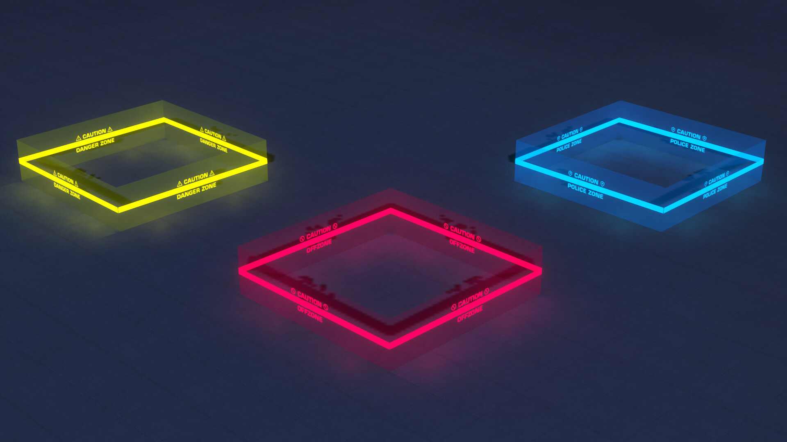
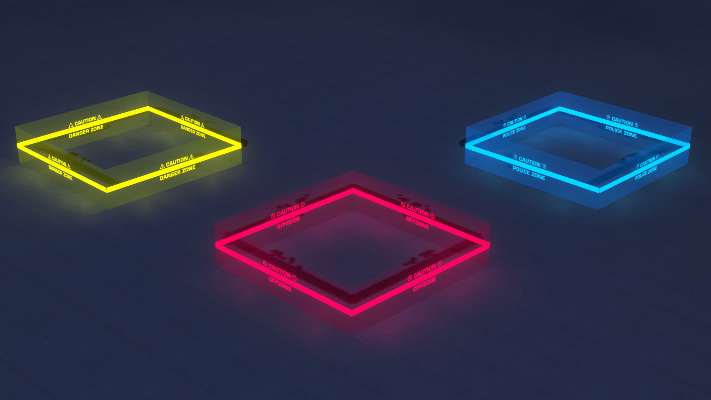

# Gallery

Showcase of Trackmania Galaxy screenshots and map previews.

## TrackMania² Pursuit

  
  
  
  
  
  

## Trackmania Galaxy

  

You can upload images to `assets/images/` and reference them here.
