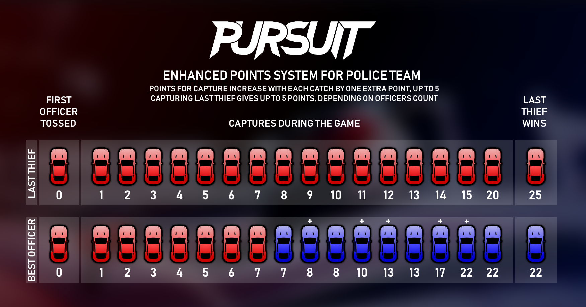
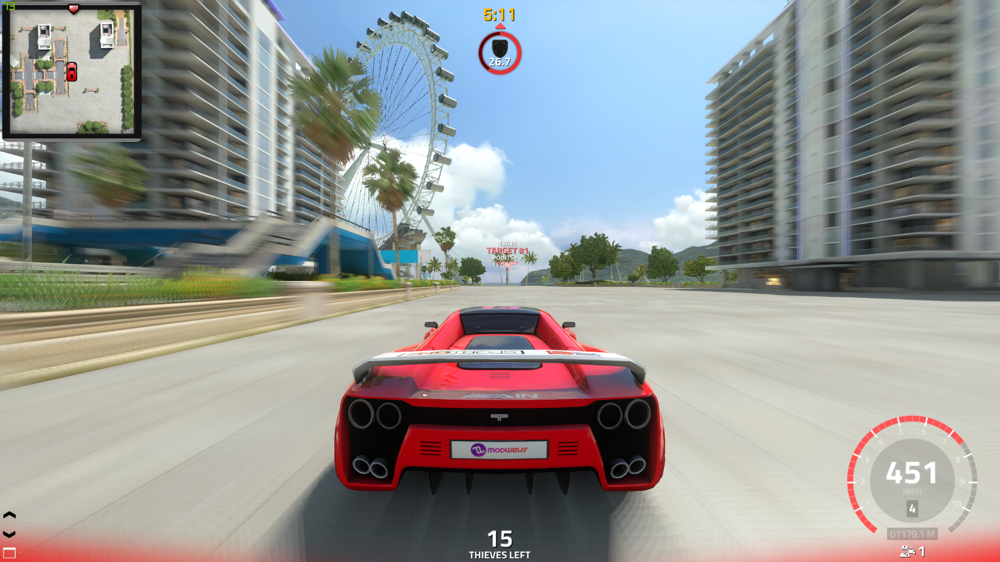
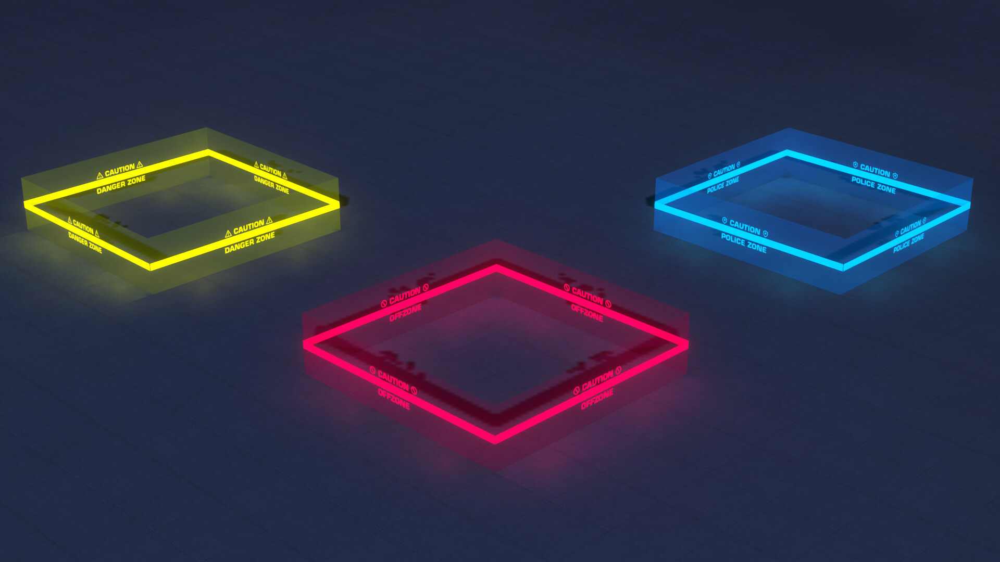
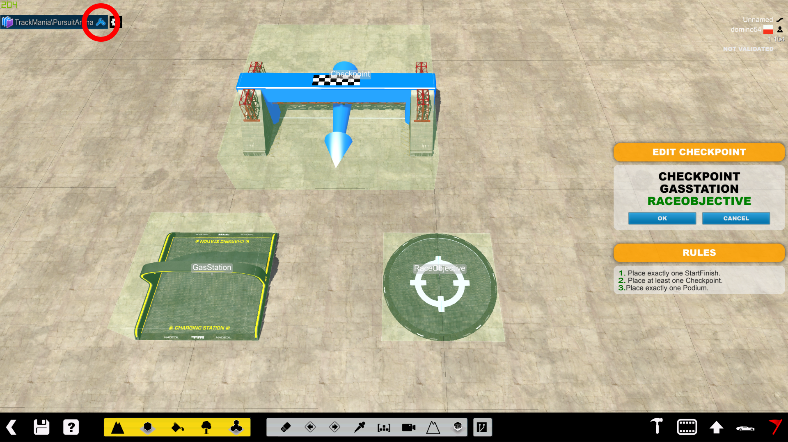
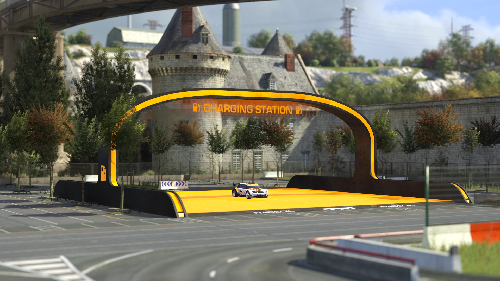

# Trackmania Galaxy: Pursuit Mode
{: .no_toc }

Documentation of the **Trackmania Galaxy** (formerly TrackMania² Pursuit) title pack — updates, zones, vehicles, and gameplay mechanics.
{: .fs-6 .fw-300 }

## Table of Contents
{: .no_toc .text-delta }

1. TOC
{:toc}

---

## Introduction

TrackMania² Pursuit is a title pack for ManiaPlanet that introduces a cops-and-thieves gameplay mode. Players are divided into two teams: **Police** (who chase and capture thieves) and **Thieves** (who survive and score points by evading capture). The mode supports multiple environments including Canyon, Stadium, Lagoon, and more.

*Third-person gameplay view showing the Pursuit HUD: minimap, timer, target indicator, and team status.*

---

## Title Update 1.2 — "Enhanced Points System" (January 2018)

This update introduced a completely overhauled, dynamic scoring system designed to balance the matches between the Police and the Thieves. It rewards late-game clutch play and ensures active participation until the final seconds of a round.

*Enhanced points system chart detailing the dynamic scaling of capture points for officers and survival points for the last remaining thief.*

### Capture Points Scaling (Police)

To reward more challenging captures in the late-game when fewer thieves are left on the track, the point value of each capture increases progressively:

- **Early-Game:** Standard captures are worth **1 point** (Captures 1 to 10).
- **Late-Game:** As the number of remaining thieves decreases, the value of subsequent captures scales up by +1 point per stage, up to a maximum of **5 points** per capture (e.g., Capture 11 is worth 2 points, Capture 12 is worth 3 points, etc.).
- **Last Thief Capture:** Safely securing the final surviving thief awards up to **5 bonus points** to the capturing officer, scaling dynamically based on the total number of active police officers currently on the server.

### Survival Points (Thieves)

Thieves are rewarded for their evasion skills and durability:

- **Elimination Points:** Every active thief receives **1 survival point** whenever another thief is caught by the police, provided they remain uncaptured themselves.
- **Last Thief Wins:** If the final remaining thief evades the police until the round timer expires, they receive a massive **+5 point bonus** on top of their accumulated survival points (e.g., reaching 25 total points instead of 20).

---

## Title Update 1.3 — "Construction Update" (June 2018)

### Vehicle Selection Screen

The vehicle selection screen now shows a picture of each car, a brief summary of pros and cons, and properly measured stats. Stats are displayed as a percentage score compared to the best car in every category.

*New vehicle selection screen showing the Valley Car with stats, pros & cons.*

### Map-Specific Gameplay Options

Mappers can now customize the game experience with several settings:

- **Choose available vehicles** — Select which vehicles can be used on your map. Only marked vehicles appear in the vehicle selection screen.
- **Force different cars for Police and Thieves** — For example, CanyonCar cops vs StadiumCar robbers.
- **Gameplay settings** — Choose between Pursuit or Hide & Seek mode, modify nametag behavior, toggle anti-camping mode, or disable free camera. Note: servers can force their own settings over map-specified ones.
- **Lock minimap rotation to North** — Useful for top-down camera angles.

### New OffZone Types

#### Danger Zone

A less lethal OffZone variant. Players inside the Danger Zone have **8 seconds** to leave before being eliminated. The zone is designed as a warning area rather than an instant-kill zone.

#### Police Zone

Marks routes available only for the Police team. Any thief who enters is instantly moved to the Police team.

{: .note }
> None of the OffZone types are automatically marked with in-game items. Mappers must place visual indicators manually using ornaments.

---

## Title Update 1.3.1 (July 2018)

### Zone Items by florenzius

Decorative items used to indicate the location of all three zone types:

- **OffZone** border indicators
- **Danger Zone** warning indicators
- **Police Zone** boundary indicators

*Neon zone indicators by florenzius: yellow (Danger Zone), red (OffZone), blue (Police Zone).*

{: .warning }
> These items are **only decorations** — they do not act as zones. You must place the zone manually using the Pursuit OffZone plugin, then use these decorations for visual feedback.

### Minor Changes

- Custom chat now shows message time; multiline chat issues are fixed.
- Alternative gameplay Stadium vehicles now have skins applied (Police CanyonCar displays correctly).
- Decoration size is now selectable in the Stadium pack.

---

## Title Update 1.4 — "4 Years of Pursuing" (February 2019)

Released on the 4th anniversary of the mode's first release.

### Capture Assists 👮‍+👮‍

The game now detects who contributed to catching a thief besides the person who made the capture. You are considered an assistant if you:

- **Chase** a thief for long enough (chase sequence detected).
- **Provoke** a thief to start moving/escape (nearest policeman within range gets the assist).
- **Force a thief** to drop off ledges, cliffs, or drive downhill (nearest policeman gets the assist).

**Rewards:**
- Assisting in a capture gives you **1 point**.
- If you are marked as an assistant and the thief dies through any other means, it counts as **your** catch.
- Assistance status is kept for **15 seconds** after performing a qualifying action.

### TrackMania Forever Vehicles 🚗

All 6 "new" TrackMania Forever vehicles are now available without Planet paywalls:

- Upgraded **Island Car**
- Upgraded **Desert Car**
- Upgraded **Snow Car**
- Plus additional models from Purification and TM ONE crew

{: .note }
> TrackMania 2 vehicles were unavailable for the first week to let players experience the new cars in their full glory.

### Goal Hunt Pursuit 🎯

A new gameplay variant combining Pursuit with Goal Hunt:

- Thieves don't get survival points when someone else is captured.
- Instead, thieves play **Goal Hunt** to score points (2 points per goal reached).
- Each thief has an individual goal; once reached, the next is picked randomly.
- Once caught, the only way to score is by catching thieves as a policeman.
- Available with standard Survival Pursuit — just add Goal Hunt maps to a server.

### Speedbomb 💣

A new mechanic that "equips" your car with a bomb ignited by driving at **slow speed**:

- Camping triggers an explosion after **5 seconds** of inactivity.
- Forces players to stay fast or lose their thief/policeman status.
- Maps can enable/disable Speedbomb in their properties.

### 3 Brand New Zones 🚧

#### Thief Zone 🦹‍

- Accessible only by thieves. Police cannot enter (instant respawn).
- Thieves can stay inside for **2 seconds maximum** — creates short escape shortcuts.
- Time remaining does **not** reset when leaving; regenerates slowly to prevent camping.

#### Speedbomb Zone 💣

- Enables the speedbomb mechanic for any player inside this zone.
- Minimum speed requirements are **twice as high** as map-wide Speedbomb (200 km/h).
- Limits can be customized in map properties.

#### Police Danger Zone 👮‍⚠

- A **combo zone** created by placing both Danger Zone and Police Zone in the same area.
- Combines both effects: police-only access with the 8-second escape timer for thieves.

*New zone indicators: green (Speedbomb Zone), orange (Thief Zone), blue/cyan (Police Danger Zone).*

### Fuel & Charging Stations ⛽

Maps can feature **Charging Stations** that enable a fuel mechanic:

- Cars have a gas tank that slowly depletes while driving.
- **Full tank**: 3 minutes of driving OR 12 minutes of standing still.
- Refilling is almost immediate upon entering a station.
- When fuel is enabled, **policemen must wait 15 seconds** for respawn (same as thieves) to maintain balance.

*The Charging Station object placed on a map — players refuel here to keep driving.*

### Race Objectives 🎯

Points placed on tall or climbing-heavy maps:

- Each Race Objective starts with up to **10 points** (depending on player count).
- First player to reach it gets the most points; each subsequent player gets one less.
- Once depleted, the objective no longer awards points.
- Points are awarded regardless of team.

### UI Optimization

- Client UI is now fully separated from server updates.
- UI bugs can be fixed without a server update.
- Translations can be updated independently.

### Quality of Life Changes

| Change | Details |
|--------|---------|
| **Thieves buffed** | Up to 4 survival points (instead of 1), scaling with remaining thieves |
| **Lagoon Car bonus** | +1 point for capturing a Lagoon Car thief in a different car |
| **Lagoon Car time** | 2 hours (instead of 30 min), timer only ticks when spawned with the car |
| **No spawn multi-kills** | AFK players at spawn become policemen when the round starts |
| **Spawn delay** | First spawn has a 1.5s delay to prevent game-hang desync |

### Mapper Notice: Charging Stations & Race Objectives

To enable these items on your map:

1. Edit the anchor data of the item.
2. Set the tag to `GasStation` or `RaceObjective` accordingly.

*Map editor showing anchor data configuration with GasStation and RaceObjective tags.*

{: .warning }
> **Both items must be placed:**
> - Level horizontally (no rotation on any axis)
> - Aligned to cardinal directions
> - Can be placed off-grid at arbitrary X/Y/Z coordinates

---

## Forum Discussion Highlights

### Zone Visibility (June–July 2018)

**Miss** asked how the Police Zone is indicated in-game. **Dommy** (title creator) responded:

> Unfortunately none of all OffZone types are automatically marked with any items whatsoever. The Police Zone remains a mystery until one accidentally drives into it. Danger Zone causes less trouble, since one gets some time to escape.

Dommy envisions the indication as something similar to NFS barrier arrows, but with police car icons and a "Police Zone" text.

### Auto-Placement of Zone Items (July 2018)

**Miss** suggested placing visual feedback items automatically for consistency. **Dommy** explained:

> Placing the items automatically would be possible only if:
> 1. TrackMania supports dynamic items (like ShootMania), OR
> 2. Map types / editor plugins can place items.

Manual placement has an advantage — the mapper marks only the entrance, while a script would place items inside walls or overlap with them.

---

## Galaxy Rebase — TMAll Update (November 2024)

TrackMania² Galaxy has been **rebased on the latest version of TMAll**, bringing all the newest TMAll features directly into Galaxy. This is a major milestone unifying the codebase.

### 🎉 New Features

- **MP Store integration** — access the ManiaPlanet Store directly from Galaxy
- **Trailer skins for TM2 cars in Stadium** — custom skins now available for thieves in Stadium environment
- **Persistent Storage Crash Fix** — the notorious "29.9 bug" is now resolved
- **Goal Hunt Maps** — all Goal Hunt maps (including new ones) are now properly detected and automatically switch the mode to Goal Hunt Pursuit
- **TrafficCar playable in Pursuit** — available if the currently played map explicitly enables it (to keep ValleyCar relevant)
- **LagoonCar in Map Editor** — now fully accessible inside the editor
- **Map Voting Screen update** — now correctly suggests 6 least-played maps of the currently playing players, instead of being effectively random
- **Galaxy Stadium fresh look** — new Stadium-themed image replacing the old colour-shifted version
- **Car model fixes** — Bay Car, Coast Car, and Rally Car no longer turn white on dirt surfaces

### ⚠️ Known Limitations

- **TMU car models** remain unchanged for now
- **Galaxy Stadium** currently does not allow creating maps with different vehicles (may or may not be fixed in the future)

---

## Environments

Trackmania Galaxy supports multiple environments:

- **Canyon**
- **Stadium**
- **Lagoon**
- **Island**
- **Desert**
- **Snow**
- **Bay**
- **Coast**
- **Alpine**
- **Speed**

---

## Related Links

- [ManiaExchange](https://tm.mania.exchange)
- [Pursuit Discord](https://discord.me/pursuit)
- [Openplanet](https://openplanet.nl)

---

{: .note }
> This page is based on archived project discussions. For the latest information, check the official Openplanet resources or the Pursuit Discord.
